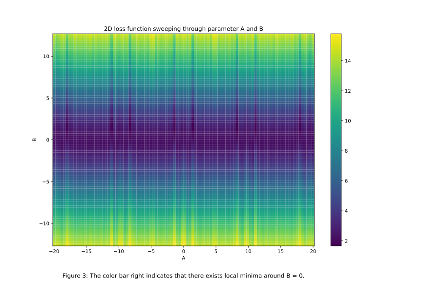
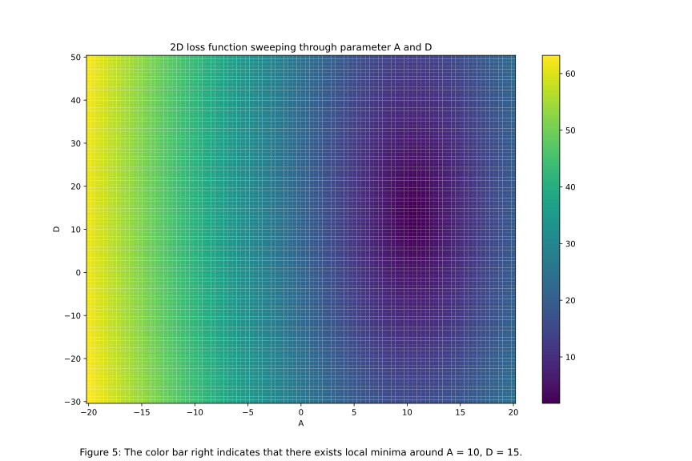

# EE399
EE399 Homework submission
# Homework Set 1: Least-Squares Fitting

Author: Ziwen(https://github.com/ZiwenLi0325)

## Abstract

This homework assignment involves fitting a model to data using least-squares error and comparing the performance of different models on training and test data. The data is provided in lecture and the goal is to find the parameters that minimize the error of the model. We also explore the 2D loss landscape and visualize the results using pcolor. Finally, we fit a line, parabola, and 19th degree polynomial to the data and compare their performance on training and test data.

## Introduction and Overview

This homework assignment is first homework for introduction to machine learning and involves using Python to fit a model to data using least-squares error. The data is provided in hw1 and the goal is to find the parameters that minimize the error of the nonlinear model. In addition, we compare the performance of different models on training and test data to evaluate their generalization capabilities.

## Theoretical Background

The theoretical background for this homework assignment includes the concept of least-squares error and its application to model fitting. We use the following model to fit the data:

f(x) = A cos(Bx) + Cx + D

The goal is to find the parameters A, B, C, and D that minimize the error of the model using the provided data. We also use the training and test data to evaluate the performance of different models, including a line, parabola, and 19th degree polynomial.

## Algorithm Implementation and Development

For part (i) of the homework, we use the provided data and the least-squares error function to find the parameters A, B, C, and D that minimize the error of the model. We use the scipy.optimize.minimize function to minimize the error function and print out the results.

For part (ii), we fix two parameters and sweep through values of the other two parameters to generate a 2D loss landscape. We use the matplotlib.pcolor function to visualize the results in a grid.

For parts (iii) and (iv), we split the data into training and test sets and fit different models to the training data. We use numpy.polyfit and the previous scipy.optimize.minimize to fit a line, parabola, and 19th degree polynomial to the data and compute the least-squares error for each model over the training points. Then we compute the least-squares error of these models on the test data, which are the remaining data points. We compare the results of these models and discuss their performance on the test data.

## Computational Results

For part (i), we find the parameters A=2.17168187, B=0.9093249, C=0.73247849, and D=31.4529185 that minimize the error of the model, with a minimum error of 1.592725.

For part (ii), we sweep through values of two parameters while fixing the other two and generate a 2D loss landscape. We find multiple minima as we sweep through parameters, indicating the presence of multiple local minima. The approximation of each minima is shown in hw1/hw1.ipynb from figure 3 to 8. We can clearly view how minima are distributed with the blue wire or center in following graphs.

For parts (iii), we fit a line, parabola, and 19th degree polynomial to the training data with first 20 truncated data and evaluate their performance on the rest of test data. We find that the 19th degree polynomial has the lowest error on the training data but performs poorly on the test data, indicating overfitting. The line and parabola have similar performance on both the training and test data, with the line slightly outperforming the parabola. The fits of all models are shown below. We can notice that while linear and parabola are not good fit, and 19th order is totally overfit.

For parts (iv), we fit a line, parabola, and 19th degree polynomial to the training data with first 10 truncated data and last 10 truncated data evaluate their performance on the test data, the middle 10 of data set. We find that the 19th degree polynomial still has the lowest error on the training data but performs poorly on the test data, indicating overfitting. However, the error for (iv) is significantly less than the error in (iii). The line and parabola have similar performance on both the training and test data, with the line slightly outperforming the parabola.We can notice that while linear and parabola are not good fit and they are pretty similar due to the boarder domain of x, and 19th order is totally overfit in the middle.

## Summary and Conclusions

In this homework assignment, we used Python to fit a model to data using least-squares error. We first found the parameters that minimized the error of the nonlinear model and visualized the 2D loss landscape. Then, we evaluated the performance of different models on training and test data. We found that the 19th degree polynomial had the lowest error on the training data but overfit on the test data, while the line and parabola had similar performance on both the training and test data. Additionally, when we split the data into three sets, the middle 10 data points performed better than the first 10 and last 10 data points for all three models. These results indicate the importance of properly evaluating model performance on test data and avoiding overfitting by using simpler models or regularization techniques. In addition, we notice that in general the traing data on the boundary of data set will provide better fit comparing the data from one side.
