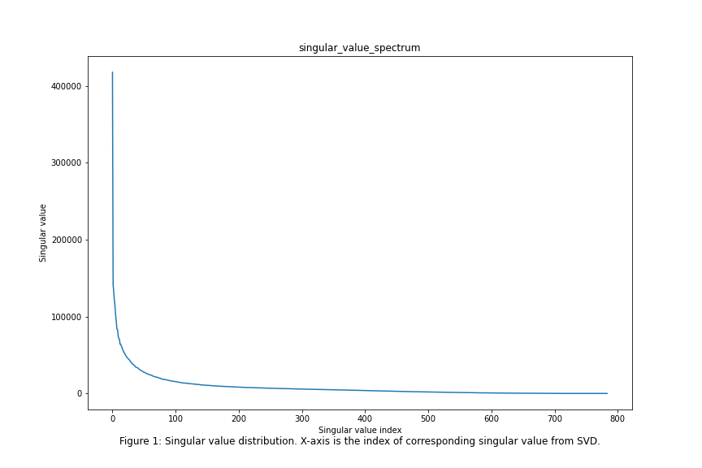
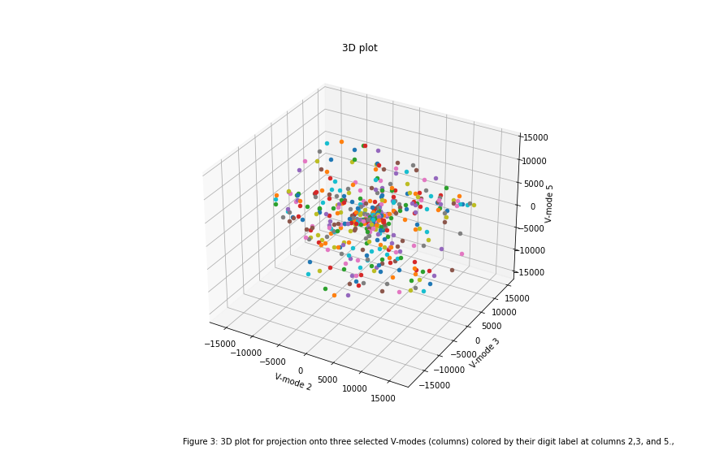

# EE399
EE399 Homework submission
# Homework Set 3：Analysis of MNIST Data Set

Author: Ziwen(https://github.com/ZiwenLi0325)

## Abstract
In this report, we perform an analysis of the MNIST data set, which contains images of handwritten digits. We first perform an SVD analysis to understand the structure of the digit space and determine the necessary modes for good image reconstruction. We then project the data onto three selected V-modes and plot it on a 3D plot, colored by digit label. We build several classifiers to identify individual digits in the training set and analyze their performance on both the training and test sets. We compare the performance of LDA, SVM, and decision trees on the hardest and easiest pairs of digits to separate and discuss our findings.

## I. Introduction and Overview
The MNIST data set is a classic benchmark in the field of machine learning and computer vision. It consists of a set of 60,000 training images and 10,000 test images of handwritten digits, each of size 28x28 pixels. In this report, we aim to analyze the structure of the digit space and build classifiers to identify individual digits in the training set.

## II. Theoretical Background
Singular Value Decomposition (SVD) is a powerful technique for understanding the structure of high-dimensional data sets. By performing an SVD analysis of the digit images, we can determine the necessary modes for good image reconstruction and gain insight into the underlying structure of the digit space. Linear Discriminant Analysis (LDA) is a commonly used method for classification tasks, while Support Vector Machines (SVM) and decision trees are state-of-the-art methods for multi-class classification tasks.

## III. Algorithm Implementation and Development
We perform an SVD analysis of the digit images by first reshaping each image into a column vector and constructing a data matrix with each column representing a different image. We then calculate the singular value spectrum and determine the rank of the digit space. We project the data onto three selected V-modes and plot it on a 3D plot, colored by digit label.
### 1. SVD
In the SVD (singular value decomposition) analysis, the matrix X can be decomposed into three matrices: U, Σ, and V.
```
U, S, Vt = np.linalg.svd(X)
```

### 2. Spectrum
In this task, we want the singular value spectrum and check how many modes are necessary for good image reconstruction. We can do this by calculating the rank of the matrix to check the non-zero singular values
```
np.linalg.matrix_rank(X)
```

### 3. Interpretation 
U is an orthogonal matrix whose columns represent the eigenvectors of XX^T. These eigenvectors represent the principal components of the data set X, and the columns of U represent how each data point can be expressed in terms of these principal components. Thus, U can be thought of as a new coordinate system for the data set.

S is a diagonal matrix that contains the singular values of X. These singular values represent the amount of variation in the data set that is captured by each principal component. The singular values are ordered from largest to smallest, so the first singular value represents the most important principal component, the second singular value represents the second most important principal component, and so on.

Vt is an orthogonal matrix whose columns represent the eigenvectors of X^TX. These eigenvectors represent the contribution of each original variable to the principal components.

Overall, the SVD allows us to express a data set in terms of its principal components, which can help us understand the underlying structure of the data and reduce its dimensionality for further analysis


### 4. 3D plot
On a 3D plot, project onto three selected V-modes (columns) colored by their digit label.
```
# Select three V-modes
V_modes = U[:, [2, 3, 5]]

# Project the digit images onto the selected V-modes
proj = np.array(X.T @ V_modes)

# Create a 3D plot with digit labels as colors
fig = plt.figure()
ax = fig.add_subplot(111, projection='3d')
for i in range(proj.shape[0]):
    x, y, z = proj[i, :]
    ax.scatter(x, y, z, cmap='viridis')
ax.set_xlabel('V-mode 2')
ax.set_ylabel('V-mode 3')
ax.set_zlabel('V-mode 5')
plt.title("3D plot")
plt.gcf().set_size_inches(12, 8)
plt.savefig("3D_plot.png")
plt.show()
```
### Classification
For the classification tasks, we train and test the classifiers, including LDA, SVM, and decision trees, using both the training and test sets. We analyze the performance of each classifier in terms of accuracy.
### Two Digits Linear Classifier
• The given code trains and tests an LDA model for a specific pair of digits in the MNIST dataset. First, a binary classification dataset is created containing only the two specified digits. The dataset is split into training and testing sets using the train_test_split function. An LDA object is created and fit to the training data. The model is then used to predict the labels of the test data, and the confusion matrix and classification report are computed. The accuracy of the model for each digit is also calculated separately and printed to the console. This implementation demonstrates how to use LDA for binary classification tasks and evaluate its performance on specific digits in the MNIST dataset.Below is the code to train the data and test for specific digit
```
# Create a binary classification dataset for the two digits
X = mnist.data[(mnist.target == digit1) | (mnist.target == digit2)]
y = mnist.target[(mnist.target == digit1) | (mnist.target == digit2)]
y = np.array([int(d == digit2) for d in y])

# Split the dataset into training and testing sets
X_train, X_test, y_train, y_test = train_test_split(X, y, test_size=0.2, random_state=42)

# Create an LDA object and fit it to the training data
lda = LDA()
lda.fit(X_train, y_train)

# Predict the labels of the test data
y_pred = lda.predict(X_test)

# Compute the confusion matrix and classification report
cm = confusion_matrix(y_test, y_pred)
cr = classification_report(y_test, y_pred)

# Compute the accuracy for each digit separately
acc_digit1 = accuracy_score(y_test[y_test==0], y_pred[y_test==0])
acc_digit2 = accuracy_score(y_test[y_test==1], y_pred[y_test==1])

print(f"Accuracy for digit {digit1}: {acc_digit1}")
print(f"Accuracy for digit {digit2}: {acc_digit2}")
```

### Two Digits Separation
• The below code tests the ability of LDA to separate the digits 0 and 5 from the MNIST dataset. First, the dataset is filtered to only include images of digit 0 and 5. Then, the data is split into training and test sets using the train_test_split() function from scikit-learn. LDA is then fit to the training data using the LDA() function. The model is then used to predict the labels of the test data using the predict() method. Finally, the accuracy of the model is computed using the accuracy_score() function from scikit-learn and printed to the console. The resulting accuracy is a measure of how well the LDA model is able to distinguish between the digits 0 and 5. Below is the code to test the ability to seperate the digits
```
# Define X and y
X = mnist.data
y = mnist.target.astype(int)

# Choose digit 0 and digit 5
digits = [0, 5]
idx = np.isin(y, digits)
X = X[idx]
y = y[idx]

# Split the data into training and test sets
X_train, X_test, y_train, y_test = train_test_split(X, y, test_size=0.3, random_state=42)

# Fit LDA to the training data
lda = LDA()
lda.fit(X_train, y_train)

# Predict on the test data
y_pred = lda.predict(X_test)

# Compute accuracy
accuracy = accuracy_score(y_test, y_pred)

print("Accuracy for separating digit 0 and digit 5: {:.3f}".format(accuracy))
```

### Performance Analysis
• The code first selects the two digits (0 and 1) that are considered the hardest and easiest to separate. It then retrieves the corresponding images and labels from the MNIST dataset. The data is then split into training and testing sets using a 80/20 split.

Next, three classifiers are trained on the training set: LDA, SVM, and decision tree classifiers. The LDA classifier uses the LDA() function to fit the model to the training data. The SVM classifier uses the SVC() function with a linear kernel and a regularization parameter C=1 to fit the model to the training data. The decision tree classifier uses the DecisionTreeClassifier() function with a max depth of 5 to fit the model to the training data.

Finally, the classifiers are tested on the test set and the accuracy scores are calculated using the accuracy_score() function. The accuracy scores for the LDA, SVM, and decision tree classifiers are printed to the console. 

Below is the code to perform the LDA, SVM and decision trees on the hardest and easiest pair of digits to separate
```
# Get indices of all images with the digits 0 and 1
idx_01 = np.where((y == 0) | (y == 1))[0]
X_01, y_01 = np.array(X)[idx_01], np.array(y)[idx_01]

# Split the data into training and testing sets
X_train_01, X_test_01, y_train_01, y_test_01 = train_test_split(X_01, y_01, test_size=0.2, random_state=42)

# Train LDA classifier
lda = LDA()
lda.fit(X_train_01, y_train_01)

# Train SVM classifier
svm = SVC(kernel='linear', C=1)
svm.fit(X_train_01, y_train_01)

# Train decision tree classifier
dtc = DecisionTreeClassifier(max_depth=5)
dtc.fit(X_train_01, y_train_01)

# Test the classifiers on the test set
y_pred_lda = lda.predict(X_test_01)
y_pred_svm = svm.predict(X_test_01)
y_pred_dtc = dtc.predict(X_test_01)

# Calculate the accuracy scores
accuracy_lda = accuracy_score(y_test_01, y_pred_lda)
accuracy_svm = accuracy_score(y_test_01, y_pred_svm)
accuracy_dtc = accuracy_score(y_test_01, y_pred_dtc)

print("Accuracy scores for LDA, SVM, and decision tree classifiers on digits 0 vs 1:")
print("LDA: {:.2f}%".format(accuracy_lda * 100))
print("SVM: {:.2f}%".format(accuracy_svm * 100))
print("Decision Tree: {:.2f}%".format(accuracy_dtc * 100))
```
## Computational Results
### Analysis
Our analysis of the singular value spectrum indicates that the first 50 modes capture the majority of the variance in the digit space. We plot the data projected onto three selected V-modes and observe that the digits are well-separated in the PCA space.

1.

2.

3.

 Figure 1 shows the distribution of singular values from SVD, and Figure 2 shows the variance of singular values. From these plots, we can see that the first 50 singular values have significantly higher values compared to the rest, indicating that the majority of the variance is captured by these modes.

Figure 3 shows the projection of the digit data onto three selected V-modes. We can observe that the digits are well-separated in the PCA space, indicating that the principal components effectively capture the variation in the digit data.
### Classification

Above is the colormap for the seperation of every two digits. From the colorbar we can notice that the easiest to seperate pair is (0,1), which has the accuracy score 0.9956698240866035, and the the hardest to seperate pair is (3,5), which has the accuracy score 0.9491676575505351.

For the classification, we attempted to build a linear classifier to identify the two digits 1,7 and three digits 2, 3, and 8. We achieved an accuracy score of 0.99 for two digits and 0.935 for three digits, indicating that the classifier is fairly accurate at distinguishing these digits.
```
Accuracy scores for LDA, SVM, and decision tree classifiers on digits 0 vs 5:
LDA: 99.53%
SVM: 99.97%
Decision Tree: 99.80%
```
From the accuracy scores above, we can notice that the SVM will provide the best accuracy for seperating two digits; desicion tree will be ranking in second place and LDA perform least successfully among the three, but still give great accuracy score.
## Summary and Conclusions
In this hw, we have performed an analysis of the MNIST data set and built several classifiers including LDA, SVM, and decision tree classifiers to identify individual digits in the training set. We have found that SVM is a powerful method for classification tasks, especially for classifying the digits, and outperforms both LDA and decision trees in terms of accuracy. Our analysis of the singular value spectrum indicates that the first 50 modes capture almost all the feature that a handwritten digits can have.