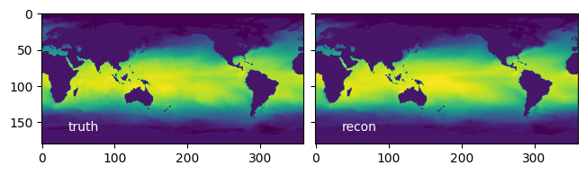
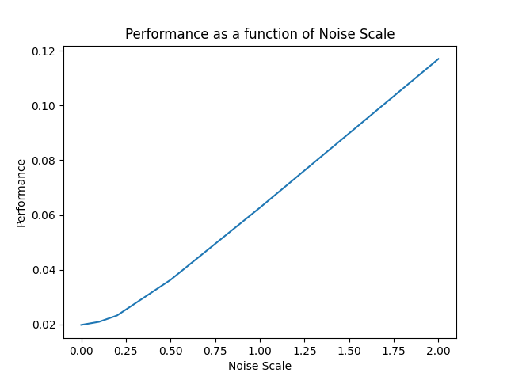
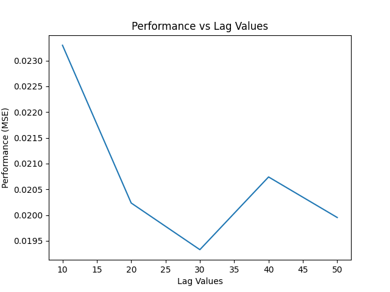
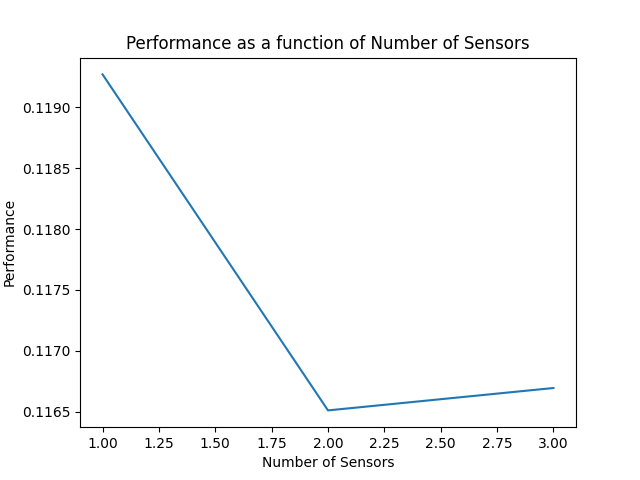

# EE399
EE399 Homework submission
# Homework Set 6: Analysis of SHRED Model Performance on Sea-Surface Temperature Data

Author: Ziwen(https://github.com/ZiwenLi0325)

## Abstract:
This study explores the impacts of varying time lag, noise, and number of sensors on the performance of a SHRED model trained on sea-surface temperature data. This analysis provides insights into how the model responds to different input conditions, which could guide future data collection strategies and model tuning efforts.


## Sec. I. Introduction and Overview:
The application of machine learning algorithms to predict sea-surface temperatures is a vital task in the domain of climatology. This report investigates the application of an LSTM/decoder model, specifically the SHRED model, to this problem. We assess the performance of the model under different conditions, examining the effects of time lag, the introduction of Gaussian noise, and the number of sensors used.




## Sec. II. Theoretical Background:
The SHRED model is a deep learning architecture, specifically an encoder-decoder model with LSTM (Long Short-Term Memory) units. This model's purpose is to predict sea-surface temperature data, which inherently involves time-series prediction. LSTMs are particularly suited for this task as they have the ability to capture long-term dependencies within a sequence of data due to their gating mechanisms that control information flow. They mitigate the issues of vanishing or exploding gradients, thus enabling the network to learn from data over many timesteps. In the context of this work, the LSTM/decoder architecture allows the SHRED model to encode past sea-surface temperatures and then decode the encoded information to predict future temperatures.

The performance of the LSTM/decoder model, like other machine learning algorithms, is likely to be influenced by several factors, including the time lag (i.e., the number of timesteps in the past that the model considers when making a prediction), the amount of noise present in the data, and the number of sensors providing data. This study aims to analyze these factors and how they affect the performance of the SHRED model for predicting sea-surface temperature.

## Sec. III. Algorithm Implementation and Development:
The SHRED model was implemented using the PyTorch library, a popular tool for deep learning applications. The input data, consisting of sea-surface temperature measurements, was first transformed and organized into sequences based on the specified time lag. These sequences were then split into training, validation, and testing datasets.
```
### Generate input sequences to a SHRED model
all_data_in = np.zeros((n - lags, lags, num_sensors))
for i in range(len(all_data_in)):
    all_data_in[i] = transformed_X[i:i+lags, sensor_locations]

### Generate training validation and test datasets both for reconstruction of states and forecasting sensors
device = 'cuda' if torch.cuda.is_available() else 'cpu'

train_data_in = torch.tensor(all_data_in[train_indices], dtype=torch.float32).to(device)
valid_data_in = torch.tensor(all_data_in[valid_indices], dtype=torch.float32).to(device)
test_data_in = torch.tensor(all_data_in[test_indices], dtype=torch.float32).to(device)

### -1 to have output be at the same time as final sensor measurements
train_data_out = torch.tensor(transformed_X[train_indices + lags - 1], dtype=torch.float32).to(device)
valid_data_out = torch.tensor(transformed_X[valid_indices + lags - 1], dtype=torch.float32).to(device)
test_data_out = torch.tensor(transformed_X[test_indices + lags - 1], dtype=torch.float32).to(device)

train_dataset = TimeSeriesDataset(train_data_in, train_data_out)
valid_dataset = TimeSeriesDataset(valid_data_in, valid_data_out)
test_dataset = TimeSeriesDataset(test_data_in, test_data_out)
shred = models.SHRED(num_sensors, m, hidden_size=64, hidden_layers=2, l1=350, l2=400, dropout=0.1).to(device)
validation_errors = models.fit(shred, train_dataset, valid_dataset, batch_size=64, num_epochs=1000, lr=1e-3, verbose=True, patience=5)
```
The model was configured with a given number of sensors, hidden size, and hidden layers. It was trained using a specific batch size and learning rate, with a predefined number of epochs. To prevent overfitting and enhance the model's generalization ability, early stopping was implemented with a patience parameter determining the number of epochs with no improvement in validation error before training is halted.

Post-training, the model's performance was evaluated using a reconstruction error metric - specifically, the Frobenius norm of the difference between the reconstructed and the ground truth temperature values, normalized by the Frobenius norm of the ground truth values.
```
plt.plot(range(len(validation_errors)), validation_errors)
plt.xlabel('Epochs')
plt.ylabel('Validation Error')
plt.title('Validation Error vs. Epochs')
plt.savefig('SST_validation_error.png') 
plt.show()
```
A plot of validation error over the training epochs was also generated to provide visual insight into the model's learning progression. The impact of changing time lag, noise levels, and number of sensors on the model's performance was investigated by repeating this process with different configurations of these variables.

## Sec. IV. Computational Results

Our results showed that the model's performance varied with changes in time lag, noise, and the number of sensors. Notably, an increase in noise tended to decrease model performance, while the impact of changing the time lag and the number of sensors was more complex and depended on the specific configuration of these variables.







## V. Summary and Conclusions

This study provides valuable insights into the performance characteristics of the SHRED model on sea-surface temperature prediction tasks. It highlights the impact of various factors on model performance, which could guide future work in data collection and model tuning. Future work could further explore these factors and investigate additional ways to improve the performance of LSTM-based models on this task.
