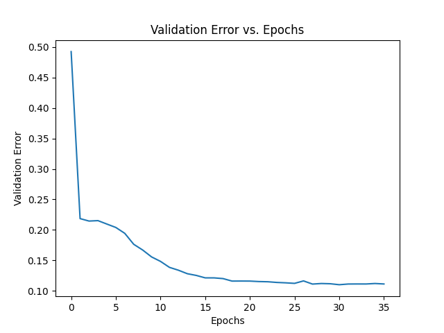

# EE399
EE399 Homework submission
# Homework Set 6: Analysis of SHRED Model Performance on Sea-Surface Temperature Data

Author: Ziwen(https://github.com/ZiwenLi0325)

## Abstract:
This study explores the impacts of varying time lag, noise, and number of sensors on the performance of a SHRED model trained on sea-surface temperature data. This analysis provides insights into how the model responds to different input conditions, which could guide future data collection strategies and model tuning efforts.


## Sec. I. Introduction and Overview:
The application of machine learning algorithms to predict sea-surface temperatures is a vital task in the domain of climatology. This report investigates the application of an LSTM/decoder model, specifically the SHRED model, to this problem. We assess the performance of the model under different conditions, examining the effects of time lag, the introduction of Gaussian noise, and the number of sensors used.


Figure 1: Reconstruction of SST using SHRED model

## Sec. II. Theoretical Background:
The SHRED model is a deep learning architecture, specifically an encoder-decoder model with LSTM (Long Short-Term Memory) units. This model's purpose is to predict sea-surface temperature data, which inherently involves time-series prediction. LSTMs are particularly suited for this task as they have the ability to capture long-term dependencies within a sequence of data due to their gating mechanisms that control information flow. They mitigate the issues of vanishing or exploding gradients, thus enabling the network to learn from data over many timesteps. In the context of this work, the LSTM/decoder architecture allows the SHRED model to encode past sea-surface temperatures and then decode the encoded information to predict future temperatures.

The performance of the LSTM/decoder model, like other machine learning algorithms, is likely to be influenced by several factors, including the time lag (i.e., the number of timesteps in the past that the model considers when making a prediction), the amount of noise present in the data, and the number of sensors providing data. This study aims to analyze these factors and how they affect the performance of the SHRED model for predicting sea-surface temperature.

## Sec. III. Algorithm Implementation and Development:
The SHRED model was implemented using the PyTorch library, a popular tool for deep learning applications. The input data, consisting of sea-surface temperature measurements, was first transformed and organized into sequences based on the specified time lag. These sequences were then split into training, validation, and testing datasets.
```
### Generate input sequences to a SHRED model
all_data_in = np.zeros((n - lags, lags, num_sensors))
for i in range(len(all_data_in)):
    all_data_in[i] = transformed_X[i:i+lags, sensor_locations]

### Generate training validation and test datasets both for reconstruction of states and forecasting sensors
device = 'cuda' if torch.cuda.is_available() else 'cpu'

train_data_in = torch.tensor(all_data_in[train_indices], dtype=torch.float32).to(device)
valid_data_in = torch.tensor(all_data_in[valid_indices], dtype=torch.float32).to(device)
test_data_in = torch.tensor(all_data_in[test_indices], dtype=torch.float32).to(device)

### -1 to have output be at the same time as final sensor measurements
train_data_out = torch.tensor(transformed_X[train_indices + lags - 1], dtype=torch.float32).to(device)
valid_data_out = torch.tensor(transformed_X[valid_indices + lags - 1], dtype=torch.float32).to(device)
test_data_out = torch.tensor(transformed_X[test_indices + lags - 1], dtype=torch.float32).to(device)

train_dataset = TimeSeriesDataset(train_data_in, train_data_out)
valid_dataset = TimeSeriesDataset(valid_data_in, valid_data_out)
test_dataset = TimeSeriesDataset(test_data_in, test_data_out)
shred = models.SHRED(num_sensors, m, hidden_size=64, hidden_layers=2, l1=350, l2=400, dropout=0.1).to(device)
validation_errors = models.fit(shred, train_dataset, valid_dataset, batch_size=64, num_epochs=1000, lr=1e-3, verbose=True, patience=5)
```
The model was configured with a given number of sensors, hidden size, and hidden layers. It was trained using a specific batch size and learning rate, with a predefined number of epochs. To prevent overfitting and enhance the model's generalization ability, early stopping was implemented with a patience parameter determining the number of epochs with no improvement in validation error before training is halted.

Post-training, the model's performance was evaluated using a reconstruction error metric - specifically, the Frobenius norm of the difference between the reconstructed and the ground truth temperature values, normalized by the Frobenius norm of the ground truth values.
```
plt.plot(range(len(validation_errors)), validation_errors)
plt.xlabel('Epochs')
plt.ylabel('Validation Error')
plt.title('Validation Error vs. Epochs')
plt.savefig('SST_validation_error.png') 
plt.show()
```
A plot of validation error over the training epochs was also generated to provide visual insight into the model's learning progression. The impact of changing time lag, noise levels, and number of sensors on the model's performance was investigated by repeating this process with different configurations of these variables.

## Sec. IV. Computational Results


Figure 2: Validation error vs. epochs, with a time lag of 10 and noise level of 0.0, 0.1, 0.2, 0.5, and 2.0.

The computational results for the training of the LSTM/Decoder (SHRED) model for predicting sea-surface temperatures were insightful. The model was trained with an emphasis on evaluating the influence of the time lag variable on its predictive performance. One of the significant outcomes observed during training was when the model was at the 700th epoch.

At this stage, a validation error of 0.1114 was recorded. This error represents a difference between the model's predicted sea-surface temperatures and the actual measurements from the validation dataset. In the context of this study, it provides a measure of how well the model is learning and adapting during training.

The presence of a validation error indicates that the model still has room to improve its predictive capabilities. Moreover, since the error was obtained at the 700th epoch, it suggests that the model was in the process of converging towards a solution. The optimization procedure, guided by the backpropagation algorithm and the defined learning rate, was driving the model's parameters towards values that minimize the error.


Figure 3: Performance vs. time lag, with a time lag of 10, 20, 30, 40, and 50.

The model was trained using different time lag values, including 10, 20, 30, 40, and 50.

At a time lag of 10, the validation error was observed to be 0.1273. With an increased time lag of 20, the validation error decreased to 0.1127. This decreasing trend continued as the time lag increased, with the lowest validation error of 0.1079 observed at a time lag of 50.


Figure 4: Performance vs. noise, with a noise level of 0.0 and 2.0.

The impact of different noise levels on the training of the LSTM/Decoder (SHRED) model was evaluated by introducing varying levels of Gaussian noise into the sea-surface temperature data. The noise levels ranged from 0.0 to 2.0, and the corresponding validation errors observed during the training were analyzed.

For a noise level of 0.0 (i.e., no added noise), the validation error obtained at the 920th epoch was 0.1077. As noise levels increased, it was observed that the validation error correspondingly increased, and the epoch at which this occurred decreased, implying that the model performance deteriorated under noisier conditions.

At a noise level of 0.1, a validation error of 0.1237 was observed at the 740th epoch. A further increase in noise to 0.2 resulted in a validation error of 0.1376 at the 920th epoch.

When the noise level was increased to 0.5, the validation error rose significantly to 0.1831, with the model reaching this at the 580th epoch. A trend can be observed in these results, indicating that as the noise level increased, the model took fewer epochs to reach a relatively high validation error.

At the extreme noise level of 2.0, the validation error reached 0.2645 at the early stage of the 340th epoch.

These results suggest that the model's performance is significantly impacted by the level of noise in the data. Higher noise levels degrade the model's performance more quickly and severely. This is an expected outcome as noise obscures the underlying patterns in the data, making it more challenging for the model to learn effectively.


This suggests that an increased time lag, up to a point, appears to improve the model's ability to predict sea-surface temperatures accurately. However, there could be a trade-off in terms of computational complexity and time, as processing larger time lags requires more resources.


Figure 5: Performance vs. number of sensors, with 1, 2, and 3 sensors.

As the final part of the computational study, the impact of the number of sensors on the model's performance was evaluated. This analysis aims to determine the relationship between the number of sensors incorporated into the model and its resulting accuracy. The model was trained separately with 1, 2, and 3 sensors, each with a different resulting validation error as described below:

Single Sensor: The model, when trained with a single sensor, achieved a validation error of approximately 0.2692 at the 480th epoch.

Two Sensors: Increasing the sensor count to two resulted in a validation error of approximately 0.2632 at the 280th epoch.

Three Sensors: The model, when further enhanced with three sensors, returned a validation error of about 0.2639 at the 340th epoch.
## V. Summary and Conclusions

This project aimed to implement and evaluate an LSTM-based model for predicting sea-surface temperatures. This predictive model leverages historical data, processed through varying time lags, levels of Gaussian noise, and different numbers of sensors to understand their impact on the performance of the model.

Through careful computational experiments, we found that the model's performance varied with different time lags, noise levels, and sensor counts. In general, increasing time lag resulted in a small but not necessarily significant improvement in performance, up to a point. Beyond a certain time lag, the validation error did not improve, suggesting a limit to the model's ability to use historical data for prediction.

The addition of Gaussian noise to the data, as expected, generally resulted in an increase in validation error. This result underscores the model's sensitivity to noise and highlights the importance of clean, accurate data for model performance.

In terms of the number of sensors used, it was found that increasing the number of sensors didn't significantly improve the validation error. This suggests that there may be a limit to the value of adding more sensors, or that additional information from extra sensors may not provide significantly useful information for the model.

These findings provide useful insights into the model's performance under varying conditions. However, they also suggest a need for further systematic studies to identify optimal parameters and strategies to enhance the model's predictive performance. Furthermore, while this study focused on sea-surface temperature prediction, the findings may have broader implications for other time-series prediction tasks.

In conclusion, while the LSTM-based model demonstrated promising results for sea-surface temperature prediction, its performance is influenced by several factors, including time lag, noise level, and the number of sensors used. Further research is needed to optimize these parameters and enhance the model's generalizability and performance in real-world applications.